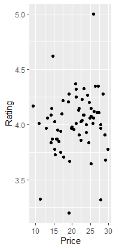

# R-Assignment 4

**Created by Sarin Weerakun (ID: 63130500115)**

Choose Dataset:
1. Top 270 Computer Science / Programing Books (Data from Thomas Konstantin, [Kaggle](https://www.kaggle.com/thomaskonstantin/top-270-rated-computer-science-programing-books)) >> [Using CSV](https://raw.githubusercontent.com/safesit23/INT214-Statistics/main/datasets/prog_book.csv)

### Outlines
1. Explore the dataset
2. Learning function from Tidyverse
3. Transform data with dplyr and finding insight the data
4. Visualization with GGplot2

## Part 1: Explore the dataset

```ruby
#Install packages
install.packages("dplyr")
install.packages("readr")
install.packages("ggplot2")
install.packages("stringr")
install.packages("tidyr")
# Library
library(dplyr)
library(readr)
library(ggplot2)
library(stringr)
library(tidyr)
# Dataset
progbook <- read_csv("RstudioCsv/prog_book.csv")
View(progbook)
```

In this dataset has 
```ruby
progbook %>% glimpse()
Rows: 271
Columns: 7
$ Rating          <dbl> 4.17, 4.01, 3.33, 3.97, 4.06, 3.84, 4.09, 4.15, 3.87, 4.62, 4.03, 3.78, 3.73, 3.87, 3.87…
$ Reviews         <dbl> 3829, 1406, 0, 1658, 1325, 117, 5938, 1817, 2093, 0, 160, 481, 33, 1255, 593, 417, 80, 2…
$ Book_title      <chr> "The Elements of Style", "The Information: A History, a Theory, a Flood", "Responsive We…
$ Description     <chr> "This style manual offers practical advice on improving writing skills. Throughout, the …
$ Number_Of_Pages <dbl> 105, 527, 50, 393, 305, 288, 256, 368, 259, 128, 352, 352, 200, 328, 240, 288, 392, 304,…
$ Type            <chr> "Hardcover", "Hardcover", "Kindle Edition", "Hardcover", "Kindle Edition", "Paperback", …
$ Price           <dbl> 9.323529, 11.000000, 11.267647, 12.873529, 13.164706, 14.188235, 14.232353, 14.364706, 1…
```


## Part 2: Learning function from Tidyverse && Part 3: Transform data with dplyr and finding insight the data


# 1.Top 5 ebook based on rating.

```ruby
progbook %>% 
  select(Book_title,Rating) %>% 
  arrange(desc(Rating)) %>% 
  head(n = 5L)
```

Result:

```ruby
   Book_title                                                                                               Rating
  <chr>                                                                                                     <dbl>
1 Your First App: Node.js                                                                                    5   
2 The Art of Computer Programming, Volumes 1-4a Boxed Set                                                    4.77
3 Designing Data-Intensive Applications: The Big Ideas Behind Reliable, Scalable, and Maintainable Systems   4.72
4 Build Web Applications with Java: Learn every aspect to build web applications from scratch                4.67
5 Fluent Python: Clear, Concise, and Effective Programming                                                   4.67
```

Explain
- ใช้ select() , arrange()  และ head โดย 
select() - ไว้เลือก ว่าเราต้องการที่จะแสดงcolumn อะไรบ้าง
arrange() - เพื่อเรียงตามtop 5 ที่จำนวน Rating สูงสุด โดยใช้ desc เพื่อให้เรียงจากมากสุดไปน้อย
และตามด้วย head() n= 5L เพื่อเอามาเพียง 5 ลำดับ


# 2.Top 5 book based on review.

```ruby
progbook %>% 
  select(Book_title,Reviews) %>% 
  arrange(desc(Reviews)) %>% 
  head(n = 5L)
```

Result:

```ruby
 Book_title                                                                             Reviews
  <chr>                                                                                    <dbl>
1 Start with Why: How Great Leaders Inspire Everyone to Take Action                         5938
2 The Elements of Style                                                                     3829
3 The Phoenix Project: A Novel About IT, DevOps, and Helping Your Business Win              2629
4 The Goal: A Process of Ongoing Improvement                                                2290
5 Weapons of Math Destruction: How Big Data Increases Inequality and Threatens Democracy    2093
```
Explain
- ใช้ select() , arrange()  และ head โดย 
select() - ไว้เลือก ว่าเราต้องการที่จะแสดง Column อะไรบ้าง
arrange() - เพื่อเรียงตาม top 5 ที่จำนวน Review สูงสุด โดยใช้ desc เพื่อให้เรียงจากมากสุดไปน้อย
และตามด้วย head() n= 5L เพื่อเลือกมาเพียง 5 ลำดับ (Top 5)


# 3.top 5 a book that cost lower than 20USD.

```ruby
progbook %>% 
  select(Book_title,Price,Rating) %>% 
  filter(Price < 20)%>%
  arrange(desc(Rating)) %>% 
  head(n = 5L)
```

Result:

```ruby
  Book_title                                                                                            Price Rating
  <chr>                                                                                                 <dbl>  <dbl>
1 ZX Spectrum Games Code Club: Twenty fun games to code and learn                                       14.6    4.62
2 The Code Book: The Science of Secrecy from Ancient Egypt to Quantum Cryptography                      19.1    4.28
3 Debugging: The 9 Indispensable Rules for Finding Even the Most Elusive Software and Hardware Problems 17.5    4.22
4 Help Your Kids with Computer Coding                                                                   18.9    4.21
5 The Elements of Style                                                                                  9.32   4.17                  
```
Explain
- ใช้ select() , filter() , arrange()  และ head โดย 
select() - ไว้เลือก ว่าเราต้องการที่จะแสดง Column อะไรบ้าง
filter() - เพื่อกรองค่าเอาเฉพาะ Price น้อยกว่า 20USD
arrange() - เพื่อเรียงตาม top 5 ที่จำนวน Review สูงสุด โดยใช้ desc เพื่อให้เรียงจากมากสุดไปน้อย
และตามด้วย head() n= 5L เพื่อเลือกมาเพียง 5 ลำดับ (Top 5)


# 4.A book that the title of book contains "Web".

```ruby
str_subset(progbook$Book_title,"Web")
```
Result:
```ruby
[1] "Responsive Web Design Overview For Beginners"                                               
[2] "Agile Web Development with Rails: A Pragmatic Guide"                                        
[3] "Build Web Applications with Java: Learn every aspect to build web applications from scratch"
[4] "PHP and MySQL Web Development (Developer's Library)"                     
```
Explain
- Stringr function
- ใช้ str_subset เพื่อให้ return data ที่มี คำว่า Web อยู่ใน $Book_title 
subset() - return a data that contain a parameter string sample of stringr function


# 5.A book that the description of book contains "hack".

``` ruby
progbook %>%
  filter(stringr::str_detect(Description,"hack")) %>%
  select(Book_title,Description)
```
Result:
```
  Book_title                                                                  Description                                                      
  <chr>                                                                       <chr>                                                            
1 Ghost in the Wires: My Adventures as the World's Most Wanted Hacker         "If they were a hall of fame or shame for computer hackers, a Ke~
2 Kingpin: How One Hacker Took Over the Billion-Dollar Cybercrime Underground "The true story of Max Butler, the master hacker who ran a billi~
3 Hacker's Delight                                                            "Aiming to tell the dark secrets of computer arithmetic, this ti~          
```
Explain
- ใช้ select() , filter() และ str_detect() โดย
select() - ไว้เลือกว่าเราต้องการที่จะแสดง Column Book_title , Description
filter() - ใช้กรองข้อมูล ตามเงื่อนไขใน str_detect() อีกที
str_detect() - หาคำว่า hack ที่มีอยู่ใน Description

# 6.A book that having a pages less than 200.
``` ruby
progbook %>% 
  select(Book_title,Number_Of_Pages) %>% 
  filter(Number_Of_Pages<200)%>%
  arrange(Number_Of_Pages) 
```
Result:
```
   Book_title                                                            Number_Of_Pages
   <chr>                                                                           <dbl>
 1 Responsive Web Design Overview For Beginners                                       50
 2 The Elements of Style                                                             105
 3 The Principles of Object-Oriented JavaScript                                      120
 4 ZX Spectrum Games Code Club: Twenty fun games to code and learn                   128
 5 Scrum and XP from the Trenches                                                    140
 6 JavaScript: The Good Parts                                                        153
 7 Think Complexity: Complexity Science and Computational Modeling                   160
 8 Agile Retrospectives: Making Good Teams Great                                     170
 9 The Pattern on the Stone: The Simple Ideas that Make Computers Work               176
10 Apprenticeship Patterns: Guidance for the Aspiring Software Craftsman             176
# ... with 12 more rows    
```
Explain
- ใช้ select() , filter() และ arrange() โดย
select() - ไว้เลือกว่าเราต้องการที่จะแสดง Column Book_title , Number_of_pages
filter() - จำนวน page น้อยกว่า 200 หน้า 
arrange() - เรียงจำนวน page จากมากไปน้อยโดยใช้ค่า default คือ ascending


## Part 4: Visualization with GGplot2
### 1.) Graph show relation between Rating and Reviews
```
showPlot <- progbook%>%ggplot(aes(x=Rating,y=Reviews))+geom_point()
showPlot
```
จะเห็นได้ว่ามี data ที่เกาะกลุ่มกันแต่ก็จะมีที่โดดเด่นออกมาก็คือในส่วนที่ review เยอะ
Result:



### 2.) BarGraph show type and how many for each type
```
booktype <- table(progbook$'Type')
barplot(booktype,main = "BookType", 
        xlab = "Type",  col = c("yellow","lightgreen","lightblue"))
```
Result:


## Part 5: Data visualization with Power BI
[PowerBI](
https://app.powerbi.com/view?r=eyJrIjoiNjRmOGU1ZmItNjM4ZC00ZWRkLWIxNjItNGZiMjdkNGVmMGM4IiwidCI6IjZmNDQzMmRjLTIwZDItNDQxZC1iMWRiLWFjMzM4MGJhNjMzZCIsImMiOjEwfQ%3D%3D)
