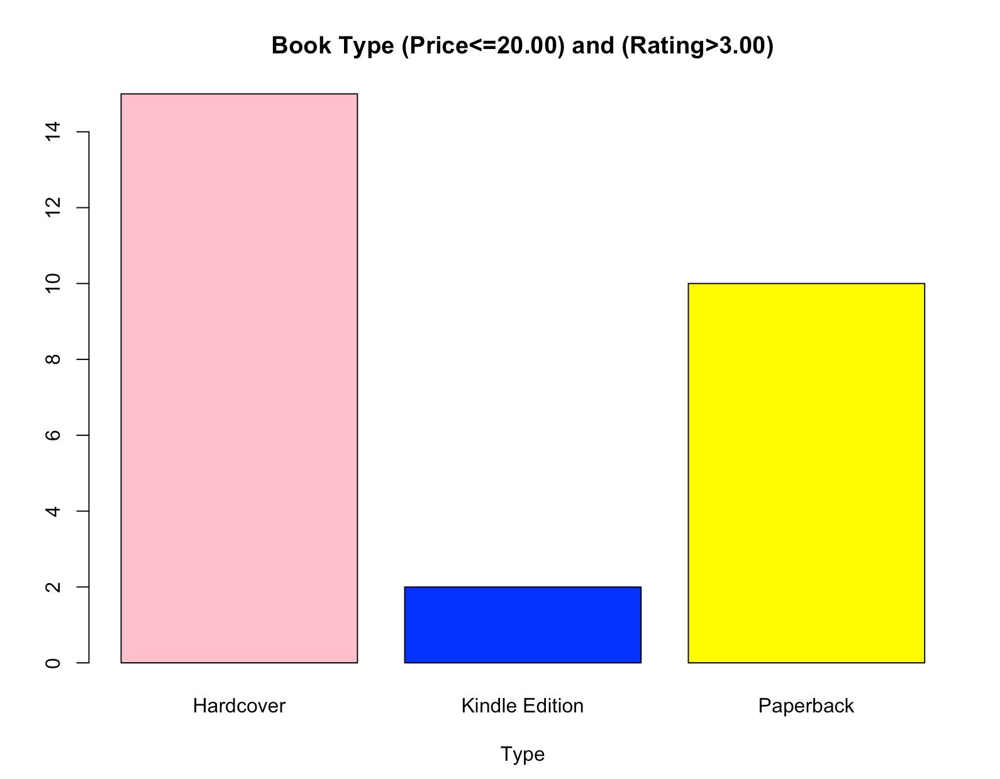
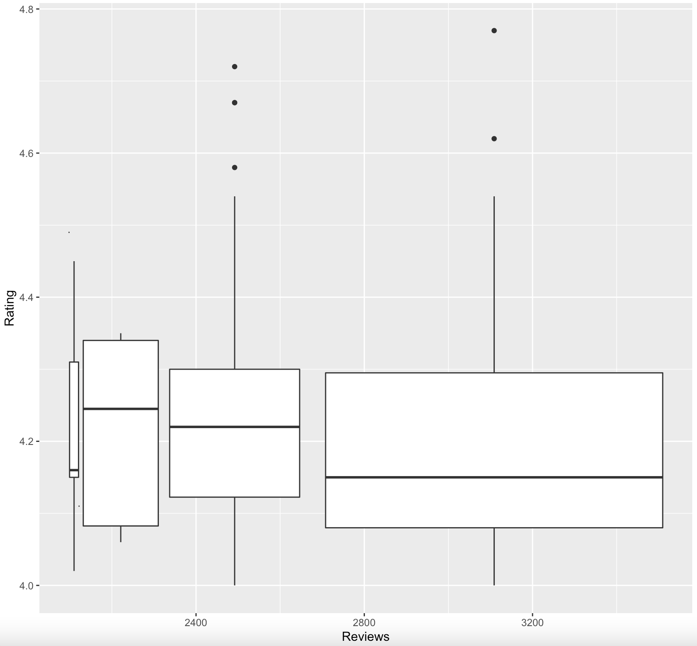

# R-Assignment 4

**Created by Supicha Piriyasiriphan (ID: 63130500124)**

Choose Dataset:
1. Top 270 Computer Science / Programing Books (Data from Thomas Konstantin, [Kaggle](https://www.kaggle.com/thomaskonstantin/top-270-rated-computer-science-programing-books)) >> [Using CSV](https://raw.githubusercontent.com/safesit23/INT214-Statistics/main/datasets/prog_book.csv)


### Outlines
1. Explore the dataset
2. Learning function from Tidyverse
3. Transform data with dplyr and finding insight the data
4. Visualization with GGplot2

## Part 1: Explore the dataset

``` ruby
# Install library
install.packages("dplyr")
install.packages("readr")
install.packages("ggplot2")
install.packages("stringr")
install.packages("data.table")
install.packages("tidyr")

# Library
library(dplyr)
library(readr)
library(ggplot2)
library(stringr)
library(data.table)
library(tidyr)

# Dataset
book <- read.csv("https://raw.githubusercontent.com/safesit23/INT214-Statistics/main/datasets/prog_book.csv")
View(book)
```

In this dataset has
``` ruby
glimpse(book)
```
Result:
```
$ Rating          <dbl> 4.17, 4.01, 3.33, 3.97, 4.06, 3.84, 4.09, 4.15, 3.87, 4.62, 4.03, 3.78, …
$ Reviews         <chr> "3,829", "1,406", "0", "1,658", "1,325", "117", "5,938", "1,817", "2,093…
$ Book_title      <chr> "The Elements of Style", "The Information: A History, a Theory, a Flood"…
$ Description     <chr> "This style manual offers practical advice on improving writing skills. …
$ Number_Of_Pages <int> 105, 527, 50, 393, 305, 288, 256, 368, 259, 128, 352, 352, 200, 328, 240…
$ Type            <chr> "Hardcover", "Hardcover", "Kindle Edition", "Hardcover", "Kindle Edition…
$ Price           <dbl> 9.323529, 11.000000, 11.267647, 12.873529, 13.164706, 14.188235, 14.2323…
```

## Part 2: Learning function from Tidyverse AND Part 3: Transform data with dplyr and finding insight the data

### ❓ Q1: หนังสือ 5 อันดับแรกที่มี Rating มากที่สุด

``` ruby
book %>% 
  select(Book_title,Rating) %>% 
  arrange(desc(Rating)) %>% 
  head(n = 5L)
```

Result:

``` 
  Book_title                                                                                                 Rating
1 Your First App: Node.js                                                                                    5.00
2 The Art of Computer Programming, Volumes 1-4a Boxed Set                                                    4.77
3 Designing Data-Intensive Applications: The Big Ideas Behind Reliable, Scalable, and Maintainable Systems   4.72
4 Build Web Applications with Java: Learn every aspect to build web applications from scratch                4.67
5 Fluent Python: Clear, Concise, and Effective Programming                                                   4.67
```
#### 💬 Explain Q1
จากผลลัพธ์จะบอกหนังสือทั้ง 5 เล่มที่มี Rating สูงที่สุดในบรรดากลุ่มข้อมูล โดยมีการใช้
1. select() เลือกข้อมูลในตารางที่ต้องการแสดง
2. arrange() เรียงลำดับข้อมูล โดยกำหนดด้านในเป็น desc เพื่อเรียงข้อมูลจากมากไปหาน้อย
3. head() เอากลุ่มข้อมูลตามจำนวนที่กำหนด

### ❓ Q2: ค่าเฉลี่ยหน้าหนังสือ(Number_Of_Pages) ที่มียอดรีวิว(Reviews)สูงสุด 10 อันดับแรก

``` ruby
# clean แปลงให้ Reviews จาก character เป็น numeric
book$Reviews <- book$Reviews %>% str_remove(',') 
book$Reviews <- as.numeric(book$Reviews)

# หาค่า mean
findMean <- book %>% 
  select(Book_title,Number_Of_Pages,Reviews) %>% 
  arrange(desc(Reviews)) %>% 
  head(n = 10L)
findMean
findMean$Number_Of_Pages %>% mean()
```

Result:

``` 
  Book_title                                                                                      Number_Of_Pages Reviews
1  Start with Why: How Great Leaders Inspire Everyone to Take Action                              256             5938
2  The Elements of Style                                                                          105             3829
3  The Phoenix Project: A Novel About IT, DevOps, and Helping Your Business Win                   345             2629
4  The Goal: A Process of Ongoing Improvement                                                     384             2290
5  Weapons of Math Destruction: How Big Data Increases Inequality and Threatens Democracy         259             2093
6  The Innovators: How a Group of Hackers, Geniuses and Geeks Created the Digital Revolution      542             2092
7  Algorithms to Live By: The Computer Science of Human Decisions                                 368             1817
8  Ghost in the Wires: My Adventures as the World's Most Wanted Hacker                            393             1658
9  The Information: A History, a Theory, a Flood                                                  527             1406
10 How Google Works                                                                               305             1325
# findmean = 348.4
```
#### 💬 Explain Q2
จากผลลัพธ์จะเห็นได้ว่าค่าเฉลี่ยหน้าหนังสือที่ได้รับการรีวิวมากจะมีค่าเฉลี่ย = 348.4 หน้า โดยมีการใช้
1. select() เลือกข้อมูลในตารางที่ต้องการแสดง
2. arrange() เรียงลำดับข้อมูล โดยกำหนดด้านในเป็น desc เพื่อเรียงข้อมูลจากมากไปหาน้อย
3. head() เอากลุ่มข้อมูลตามจำนวนที่กำหนด
4. mean() หาค่าเฉลี่ย
5. str_remove() เป็นการลบสิ่งที่ไม่ต้องการออก โดยทำการระบุในวงเล็บ
6. as.numeric() เปลี่ยนประเภทข้อมูลให้กลายเป็น numeric

### ❓ Q3: หนังสือที่มี Rating ต่ำสุดและสูงสุด 5 อันดับและนำมาหาค่าเฉลี่ยของราคา(Price)แล้วนำข้อมูลมาเปรียบเทียบ

``` ruby
# ค่าเฉลี่ยราคาหนังสือที่มี Rating ต่ำสุด 5 ลำดับท้าย
lowRating <- book %>% 
  select(Book_title,Rating,Price) %>% 
  arrange(Rating) %>% 
  head(n = 5L)
lowRating
lowRating$Price %>% mean()

# ค่าเฉลี่ยราคาหนังสือที่มี Rating สูงสุด 5 ลำดับแรก
highRating <- book %>% 
  select(Book_title,Rating,Price) %>% 
  arrange(desc(Rating)) %>% 
  head(n = 5L)
highRating
highRating$Price %>% mean()
```

Result:

``` 
  Book_title                                                                                  Rating    Price
1 Advanced Game Programming: A Gamedev.Net Collection                                         3.00      59.08235
2 Cross-Platform Game Programming (Game Development) (Charles River Media Game Development)   3.00      60.39118
3 Lambda-Calculus, Combinators and Functional Programming                                     3.00      61.16765
4 Game Programming Golden Rules                                                               3.20      19.15294
5 Beginning Java 2                                                                            3.22      36.61765
# lowRating mean = 47.28235

  Book_title                                                                                                 Rating    Price
1 Your First App: Node.js                                                                                    5.00      25.85588
2 The Art of Computer Programming, Volumes 1-4a Boxed Set                                                    4.77      220.38529
3 Designing Data-Intensive Applications: The Big Ideas Behind Reliable, Scalable, and Maintainable Systems   4.72      45.56176
4 Build Web Applications with Java: Learn every aspect to build web applications from scratch                4.67      42.27647
5 Fluent Python: Clear, Concise, and Effective Programming                                                   4.67      64.09118
# highRating mean = 79.63412
```
#### 💬 Explain Q3
จากผลลัพธ์จะเห็นได้ว่าราคาหนังสือของ 5 อันดับต้นจะมีค่าเฉลี่ยที่มากกว่า(79.63) บ่งบอกได้ว่าราคานั้นอาจไม่มีผลต่อ Rating ของผู้อ่าน โดยมีการใช้
1. select() เลือกข้อมูลในตารางที่ต้องการแสดง
2. arrange() เรียงลำดับข้อมูล โดยกำหนดด้านในเป็น desc เพื่อเรียงข้อมูลจากมากไปหาน้อย หากไม่มี desc จะเป็นการเรียงจากน้อยไปมาก
3. head() เอากลุ่มข้อมูลตามจำนวนที่กำหนด
4. mean() หาค่าเฉลี่ย

### ❓ Q4: ราคาเฉลี่ยของหนังสือประเภท(Type) Hardcover

``` ruby
AvgBookHardcover <- book %>% 
  select(Book_title,Price,Type) %>% 
  filter(book$Type == "Hardcover")
AvgBookHardcover
AvgBookHardcover$Price %>% mean()
```

Result:

``` 
  Book_title                                                               Price      Type
1 The Elements of Style                                                    9.323529   Hardcover
2 The Information: A History, a Theory, a Flood                            11.000000  Hardcover
3 Ghost in the Wires: My Adventures as the World's Most Wanted Hacker      12.873529  Hardcover
4 Start with Why: How Great Leaders Inspire Everyone to Take Action        14.232353  Hardcover
5 Algorithms to Live By: The Computer Science of Human Decisions           14.364706  Hardcover
# … with 90 more rows
# AvgBookHardcover mean = 70.13449
```
#### 💬 Explain Q4
จากผลลัพธ์ค่าเฉลี่ยราคาของหนังสือประเภท Hardcover จะอยู่ที่ 70.13449 โดยมีการใช้
1. select() เลือกข้อมูลในตารางที่ต้องการแสดง
2. filter() กรองข้อมูลตามเงื่อนไข
3. mean() หาค่าเฉลี่ย

### ❓ Q5: แสดงผลรวมจำนวนรีวิวของหนังสือทั้ง 3 ประเภท(Type)ดังนี้ Hardcover, Kindle Edition, Paperback

``` ruby
BookHardcover <- book %>% 
  select(Book_title,Type,Reviews) %>% 
  filter(book$Type == "Hardcover")
BookHardcover$Reviews %>% sum()

BookKindleEdition <- book %>% 
  select(Book_title,Type,Reviews) %>% 
  filter(book$Type == "Kindle Edition")
BookKindleEdition$Reviews %>% sum()

BookPaperback <- book %>% 
  select(Book_title,Type,Reviews) %>% 
  filter(book$Type == "Paperback")
BookPaperback$Reviews %>% sum()
```

Result:

``` 
BookHardcover sum = 29942
BookKindleEdition sum = 1565
BookPaperback sum = 18136
```
#### 💬 Explain Q5
จากผลลัพธ์จะเห็นได้ว่าหนังสือ Hardcover มีจำนวนรีวิวมากที่สุดโดยมีการใช้
1. select() เลือกข้อมูลในตารางที่ต้องการแสดง
2. filter() กรองข้อมูลตามเงื่อนไข
3. sum() ผลรวมของข้อมูลชุดนี้

### ❓ Q6: หนังสือที่มีจำนวนหน้าน้อยที่สุด 5 ลำดับท้าย และคะแนน Rating ที่ไม่ต่ำกว่า 4.00

``` ruby
book %>% 
  select(Book_title,Number_Of_Pages,Rating) %>% 
  arrange(Number_Of_Pages) %>% 
  filter(Rating >= 4.00) %>%
  head(n = 5L)
```

Result:

``` 
  Book_title                                                        Number_Of_Pages   Rating
1 The Elements of Style                                             105               4.17
2 The Principles of Object-Oriented JavaScript                      120               4.35
3 ZX Spectrum Games Code Club: Twenty fun games to code and learn   128               4.62
4 Scrum and XP from the Trenches                                    140               4.20
5 JavaScript: The Good Parts                                        153               4.23
```
#### 💬 Explain Q6
จากผลลัพธ์จะบอกหนังสือที่มีจำนวนหน้าไม่เยอะและมี Rating ที่ค่อนข้างสูง โดยมีการใช้
1. select() เลือกข้อมูลในตารางที่ต้องการแสดง
2. arrange() เรียงลำดับข้อมูล โดยกำหนดด้านในเป็น desc เพื่อเรียงข้อมูลจากมากไปหาน้อย
3. filter() กรองข้อมูลตามเงื่อนไข
4. head() เอากลุ่มข้อมูลตามจำนวนที่กำหนด

## Part 4: Visualization with GGplot2
### 1.) กราฟที่แสดงผลประเภทของหนังสือที่มีราคาน้อยกว่าหรือเท่ากับ 20.00 และ Rating มากกว่า 3.00
``` ruby
data <- book %>% 
  select(Price,Rating,Type) %>% 
  filter(Price <= 20.00, Rating > 3.00)
graph1 <- table(data$'Type')
barplot(graph1,main = "Book Type (Price<=20.00) and (Rating>3.00)", 
        xlab = "Type", col = c("pink","blue","yellow"))
```
Result:



#### Explain Graph1
จากรูปจะเห็นได้ว่ามีหนังสือจำนวน 3 ประเภทที่มีราคาน้อยกว่าหรือเท่ากับ 20.00 และ Rating มากกว่า 3.00

### 2.) กราฟที่แสดงผลความสัมพันธ์ระหว่าง Rating ที่มีค่ามากกว่าหรือเท่ากับ 4.00 และ Review ที่มีค่ามากกว่า 0 โดยจัดกลุ่มตามประเภท
``` ruby
graph2 <- book %>% 
  filter(Rating >= 4.00, Reviews > 0) %>%
  ggplot(aes(x=Reviews,y=Rating,group=Type))+geom_boxplot()
graph2
```
Result:



#### Explain Graph2
จากรูปจะเห็นได้ว่ามี Outliers เป็นจำนวน 4 ข้อมูล

## Part 5: Data visualization with Power BI

