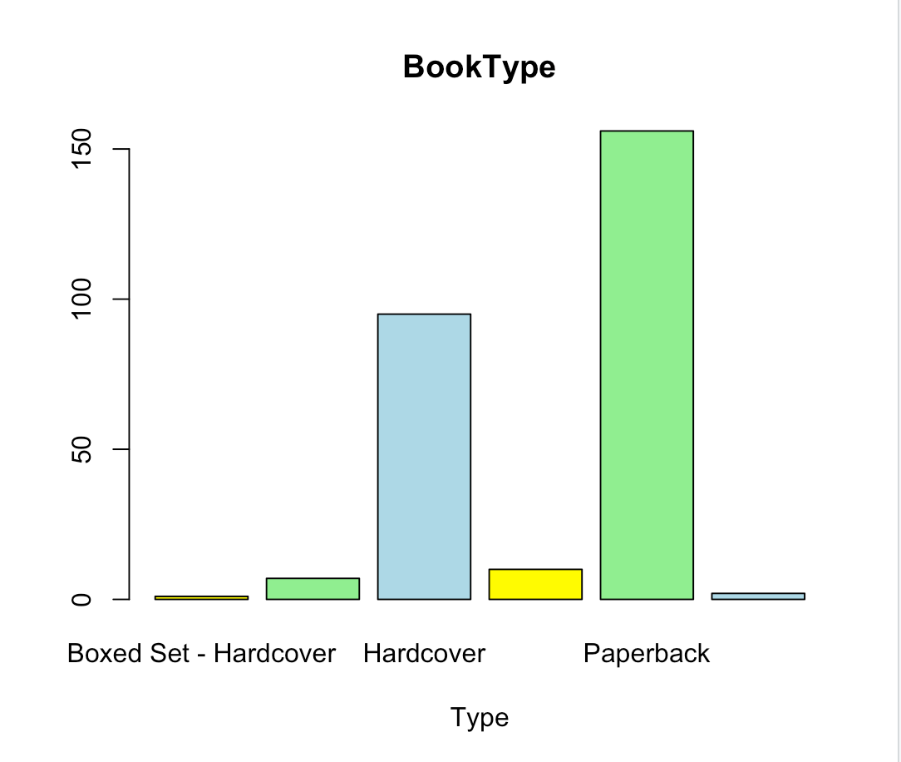

# R-Assignment 4

**Created by Udomchai-Nirasrop (ID: 63130500161)**

Choose Dataset:
1. Top 270 Computer Science / Programing Books (Data from Thomas Konstantin, [Kaggle](https://www.kaggle.com/thomaskonstantin/top-270-rated-computer-science-programing-books)) >> [Using CSV](https://raw.githubusercontent.com/safesit23/INT214-Statistics/main/datasets/prog_book.csv)

### Outlines
1. Explore the dataset
2. Learning function from Tidyverse
3. Transform data with dplyr and finding insight the data
4. Visualization with GGplot2

## Part 1: Explore the dataset

```ruby
# Library
library(dplyr)
library(readr)
library(ggplot2)
library(stringr)

# Dataset
progbook <- read_csv("Desktop/R-214/programingbook.csv")
View(progbook)
```

In this dataset has 
```ruby
progbook %>% glimpse()

Rows: 271
Columns: 7
$ Rating          <dbl> 4.17, 4.01, 3.33, 3.97, 4.06, 3.84, 4.09, 4.15, 3.87, 4.62, 4.03, 3.78, 3.73, 3.87, 3.87…
$ Reviews         <dbl> 3829, 1406, 0, 1658, 1325, 117, 5938, 1817, 2093, 0, 160, 481, 33, 1255, 593, 417, 80, 2…
$ Book_title      <chr> "The Elements of Style", "The Information: A History, a Theory, a Flood", "Responsive We…
$ Description     <chr> "This style manual offers practical advice on improving writing skills. Throughout, the …
$ Number_Of_Pages <dbl> 105, 527, 50, 393, 305, 288, 256, 368, 259, 128, 352, 352, 200, 328, 240, 288, 392, 304,…
$ Type            <chr> "Hardcover", "Hardcover", "Kindle Edition", "Hardcover", "Kindle Edition", "Paperback", …
$ Price           <dbl> 9.323529, 11.000000, 11.267647, 12.873529, 13.164706, 14.188235, 14.232353, 14.364706, 1…
```


## Part 2: Learning function from Tidyverse && Part 3: Transform data with dplyr and finding insight the data


# 1.Top 5 book that are the most review and Top 5 from the bottom

```ruby
#TOP 5
progbook %>% 
  select(Book_title,Price,Reviews) %>% 
  arrange(desc(Reviews)) %>% 
  head(n = 5L)
#BOTTOM 5
progbook %>% 
  select(Book_title,Price,Reviews) %>% 
  arrange(Reviews) %>% 
  head(n = 5L)
```

Result:
Top 5
```ruby
  Book_title                                                                             Price Reviews
  <chr>                                                                                  <dbl>   <dbl>
1 Start with Why: How Great Leaders Inspire Everyone to Take Action                      14.2     5938
2 The Elements of Style                                                                   9.32    3829
3 The Phoenix Project: A Novel About IT, DevOps, and Helping Your Business Win           24.3     2629
4 The Goal: A Process of Ongoing Improvement                                             37.1     2290
5 Weapons of Math Destruction: How Big Data Increases Inequality and Threatens Democracy 14.5     2093
```
Bottom 5
```ruby
 Book_title                                                                                         Price Reviews
  <chr>                                                                                              <dbl>   <dbl>
1 Responsive Web Design Overview For Beginners                                                        11.3       0
2 ZX Spectrum Games Code Club: Twenty fun games to code and learn                                     14.6       0
3 Game Programming Golden Rules                                                                       19.2       0
4 Beginners Guide On PHP Programming: Quick And Easy Guide To Learn PHP With My-SQL                   23.2       0
5 Python Programming Books Set: Python Programming for Beginners & Complete Guide for Python Progra…  23.9       0
```
Explain
- ใช้ select() , arrange()  และ head โดย 
select() - ไว้เลือก ว่าเราต้องการที่จะแสดงcolumn อะไรบ้าง
arrange() - เพื่อเรียงตามtop 5 ที่จำนวน review สูงสุด โดยใช้ desc เพื่อให้เรียงจากมากสุดไปน้อย
และตามด้วย head() n= 5L เพื่อเอามาเพียง 5 ลำดับ


# 2.Find the title of book that contains "game" 

```ruby
str_subset(progbook$Book_title,"Game")
```

Result:

```ruby
 [1] "ZX Spectrum Games Code Club: Twenty fun games to code and learn"                                                                          
 [2] "Game Programming Golden Rules"                                                                                                            
 [3] "Coding Games in Scratch"                                                                                                                  
 [4] "Invent Your Own Computer Games with Python, 3rd Edition"                                                                                  
 [5] "Best of Game Programming Gems"                                                                                                            
 [6] "Game Programming Patterns"                                                                                                                
 [7] "Making Games with Python & Pygame"                                                                                                        
 [8] "Building an FPS Game with Unity"                     
 ...
```
Explain
Stringr function
- ใช้ str_subset เพื่อให้ return data ที่มี คำว่า game อยู่ใน $book_title 
subset() - return a data that contain a parameter string sample of stringr function


# 3.Show Type of book and how many of each type?

```ruby
progbook %>% select(Type) %>% table()
```

Result:

```ruby
Boxed Set - Hardcover                 ebook             Hardcover        Kindle Edition             Paperback 
                    1                     7                    95                    10                   156 
      Unknown Binding 
                    2                    
```
Explain
- ใช้ select() , table()  โดย
select() - ไว้เลือกว่าเราต้องการที่จะแสดงcolumn อะไรบ้าง ซึ่งอันนี้เลือก Type ของหนังสือ โดยมาเก็บใส่ table เพื่อให้เห้นจำนวนที่ count มาให้
table() - เก็บค่า all type of book โดยแสดงเป็นจำนวนของแต่ละ Type


# 4.List The book that number of page less than 130 pages

```ruby
progbook %>% select(Book_title,Number_Of_Pages) %>% 
  filter(Number_Of_Pages < 130) %>% arrange(desc(Number_Of_Pages))
```

Result:

```ruby
 Book_title                                                      Number_Of_Pages
  <chr>                                                                     <dbl>
1 ZX Spectrum Games Code Club: Twenty fun games to code and learn             128
2 The Principles of Object-Oriented JavaScript                                120
3 The Elements of Style                                                       105
4 Responsive Web Design Overview For Beginners                                 50            
```
Explain
- ใช้ select() , filter() และ arrange() โดย
select() - ไว้เลือกว่าเราต้องการที่จะแสดงcolumn book_title , number_of_pages
filter() - จำนวน page < 130 หน้า 
arrange() - เรียงจำนวน page จากมากไปน้อยโดยใช้ desc

# 5.List The title , price , rating by sort from the most rating

``` ruby
Rate <- progbook %>% 
  select(Book_title,Price,Rating) %>%
filter(Rating > 4) %>% 
  arrange(desc(Rating))

Rate
```

Result:

```
   Book_title                                                                                         Price Rating
   <chr>                                                                                              <dbl>  <dbl>
 1 Your First App: Node.js                                                                             25.9   5   
 2 The Art of Computer Programming, Volumes 1-4a Boxed Set                                            220.    4.77
 3 Designing Data-Intensive Applications: The Big Ideas Behind Reliable, Scalable, and Maintainable …  45.6   4.72
 4 Build Web Applications with Java: Learn every aspect to build web applications from scratch         42.3   4.67
 5 Fluent Python: Clear, Concise, and Effective Programming                                            64.1   4.67
 6 ZX Spectrum Games Code Club: Twenty fun games to code and learn                                     14.6   4.62
 7 The Linux Programming Interface: A Linux and Unix System Programming Handbook                       46.4   4.62
 8 CLR via C# (Developer Reference)                                                                    66.3   4.58
 9 The Elements of Computing Systems: Building a Modern Computer from First Principles                 41.3   4.54
10 Practical Object Oriented Design in Ruby                                                            50.1   4.54
# … with 162 more rows           
```
Explain
- ใช้ select() , filter() และ arrange() โดย
select() - ไว้เลือกว่าเราต้องการที่จะแสดงcolumn book_title , number_of_pages
filter() - จำนวน page < 130 หน้า 
arrange() - เรียงจำนวน page จากมากไปน้อยโดยใช้ desc

# 6.List The Type of book and percentage of each type

``` ruby
countBookType <- progbook %>% group_by(Type) %>% count()
countBookType %>% mutate(average=(n/270)*100)
```

Result:

```
  Type                      n average
  <chr>                 <int>   <dbl>
1 Boxed Set - Hardcover     1   0.370
2 ebook                     7   2.59 
3 Hardcover                95   35.2  
4 Kindle Edition           10   3.70 
5 Paperback               156   57.8  
6 Unknown Binding           2   0.741      
```
Explain
- ใช้ select() , filter() และ arrange() โดย
select() - ไว้เลือกว่าเราต้องการที่จะแสดงcolumn book_title , number_of_pages
filter() - จำนวน page < 130 หน้า 
arrange() - เรียงจำนวน page จากมากไปน้อยโดยใช้ desc


## Part 4: Visualization with GGplot2
### 1.) Graph show relation between Rating and Reviews
```
showPlot <- progbook%>%ggplot(aes(x=Rating,y=Reviews))+geom_point()
showPlot
```
Result:


### 2.) BarGraph show type and how many for each type
```
booktype <- table(progbook$'Type')
barplot(booktype,main = "BookType", 
        xlab = "Type",  col = c("yellow","lightgreen","lightblue"))
```
Result:



**Guideline:
Embed Image by using this syntax in markdown file
````

````
